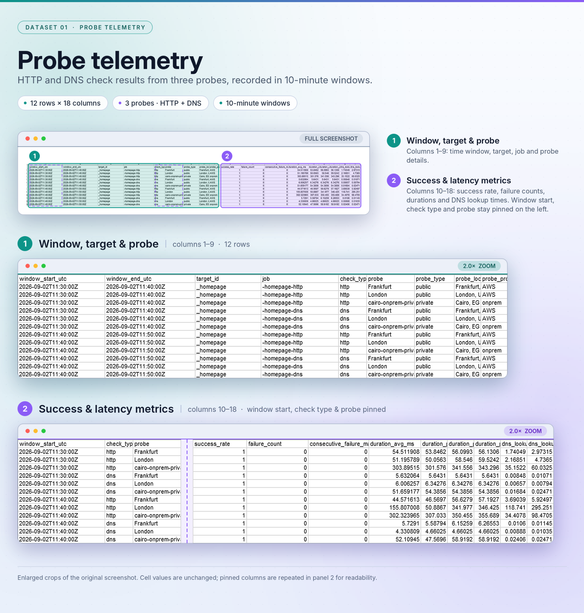
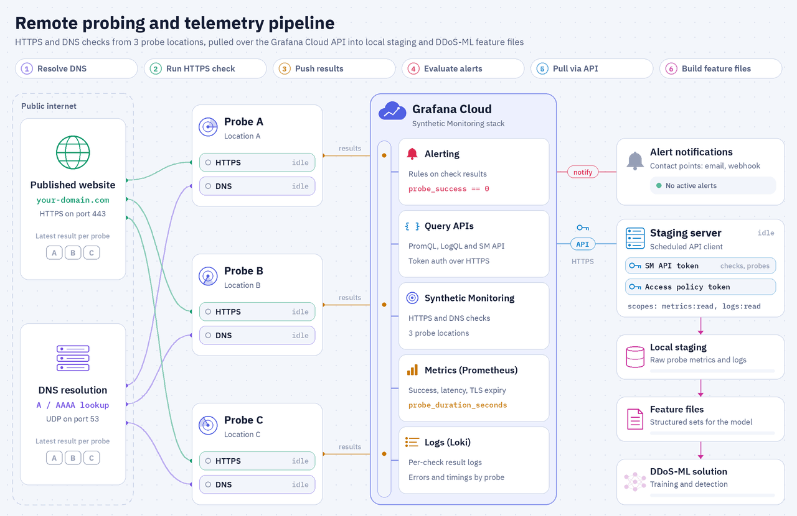

# Graphana-Remote-Probing

Graphana_Proping is the Grafana Cloud Synthetic Monitoring collector and staging layer for the DDoS-ML project. It can also be used on its own to monitor any service and raise alerts on service degradation.

It reads existing Prometheus metrics and Loki logs using a read-only token, stores the raw evidence in compressed form, and publishes a stable 38-column feature dataset for downstream machine-learning workflows.

The requested project spelling is retained in paths and release artifacts. The upstream service is **Grafana Cloud Synthetic Monitoring**.





## Scope

Included:

- Read-only Prometheus and Loki collection.
- Atomic raw JSON gzip snapshots and a latest-success manifest.
- Ten-minute ML feature windows by default.
- `probe_features_current.csv` for current inference.
- `probe_features_history.csv` for training and backtesting.
- A hardened systemd oneshot service and five-minute timer.
- Health, expiry, connectivity, authorization, freshness, and permission diagnostics.

Synthetic telemetry can provide availability and performance evidence. It does not, by itself, prove that a DDoS attack occurred.

## Prerequisites

Before installation, the operator must have:

1. Ubuntu 22.04 or 24.04 with `sudo`, systemd, DNS, NTP, and outbound HTTPS/TCP 443.
2. An active Grafana Cloud stack and working Synthetic Monitoring checks.
3. The approved HTTP and DNS job names. Probe names are discovered from returned telemetry; optional metadata can be added later in `targets.json`.
4. Prometheus query URL and username/instance ID.
5. Loki query URL and username/instance ID.
6. A dedicated Cloud Access Policy token containing only `metrics:read` and `logs:read`.
7. The token expiration date, or confirmation that the token has no configured platform expiration.
8. An approved DDoS-ML Unix group that may read the two feature CSV files.
9. An existing unprivileged Linux user for the remote DDoS-ML SSH integration. Its password is entered only in the DDoS-ML GUI and is never requested or stored by this installer.

Do not use a private-probe publishing token as the collector's read token.

## Start here: prepare Grafana Cloud before the Ubuntu VM

Complete this section first. Do not start the Ubuntu installation until both checks are producing data and all ten installer values in the final table have been recorded securely.

### 1. Create or open the Grafana Cloud stack

1. Create a Grafana Cloud account if one does not already exist. - https://grafana.com/auth/sign-up/create-user/
2. In the Cloud Portal, create or select the stack that will store the Synthetic Monitoring metrics and logs.
3. Launch the stack's Grafana instance.
4. In the left menu, select **Testing & synthetics → Synthetics**.
5. If this is the first use of Synthetic Monitoring in the stack, click **Initialize the plugin**.

### 2. Confirm the probe that will execute the checks

Decide which single probe should execute the Version 1 checks:

- If an approved private probe already exists, open **Testing & synthetics → Synthetics → Probes** and confirm that its status is online.
- Otherwise, choose one suitable Grafana-managed probe when configuring each check.
- Select only the intended probe for each check. **Every additional selected probe creates additional executions and increases usage**

This repository collects data already stored in Grafana Cloud. It does not install or register a private probe.

create Private prob if needed 
- open **Testing & synthetics → Synthetics → Probes**  add private prob
- enter the Probe Name : Unique name for this probe. example : i.e FGH
- Select Region  Region of this probe i,e EMEA
- optional Add Labels Custom labels to be included with collected metrics and logs. You can add up to 3
  environment:approved site:approved_site network:approved_network
  Capabilities
- check Disable scripted checks also check Disable browser checks

### 3. Create the HTTP check

1. Open **Testing & synthetics → Synthetics**.
2. Click **Create new check** or **Add new check**.
3. Choose **API Endpoint**, then select **HTTP**.
4. Enter a unique job name containing only letters, numbers, underscores, and hyphens; for example, `service-homepage-http`. Record it exactly because the Ubuntu installer uses this value as the Prometheus/Loki job selector.
5. Select the required Grafana folder.
6. Enter the complete authorized HTTPS request target.
7. Configure the method, redirects, TLS behavior, headers, and expected response validation required for that service. Do not store an application secret directly in this repository.
    -  check Disable target certificate validation and enable Follow HTTP redirects
8. Under **Uptime**, configure the expected successful response code and a realistic timeout.
9. Add only approved non-sensitive labels.
11. Under **Execution**, select the intended single probe and set the frequency.
    - choose three prob location one local country prob and two other external probe (i,e Select Frankfurt, London, and local on prime prob   )
    - choose execution to be Frequency 2 minute so Test executions per month 89,280 < 100000
13. Configure alerting if required by the operational design.
    - Alert if at least of 4 probe executions fail in the last 5 minute
15. Click **Test**. Continue only when the selected probe returns a successful result. (all check must be switch to green)
16. Click **Save** and keep the check enabled.

### 4. Create the DNS check

1. Open **Testing & synthetics → Synthetics** and create another **API Endpoint** check.
2. Select **DNS**.
3. Enter a different unique job name using only letters, numbers, underscores, and hyphens; for example, `service-homepage-dns`. Record it exactly.
4. Select the required folder and enter the authorized DNS record name as the request target.
5. In **Request options**, select the required IP version and record type, then enter the approved recursive DNS server, protocol, and port.
6. Under **Uptime**, use the expected DNS response code, normally `NOERROR`, and configure a realistic timeout to be Response regexp validation 3 second
7. Add only approved non-sensitive labels.
8. Under **Execution**, select the intended single probe and set the frequency. The packaged default is **600 seconds**.
    - choose three prob location one local country prob and two other external probe (i,e Select Frankfurt, London, and local on prime prob   )
    - choose execution to be Frequency 10 minute so Test executions per month 13,392 + previous 89,280 < 100000
10. Configure alerting if required.
    - Alert if at least of 2 probe executions fail in the last 10 minute
12. Click **Test**. Continue only when the selected probe returns a successful result.
13. Click **Save** and keep the check enabled.

### Final check settings

| Setting | HTTP check | DNS check | Why |
|---|---|---|---|
| Job | `homepage-http` | `homepage-dns` | Stable selector and ML identity. |
| Target | `https://www.homepage` | `www.homepage` | Authorized monitoring target. |
| Request | HTTP GET | IPv4 A query | Availability plus name resolution. |
| Resolver/protocol | System resolution before HTTPS | `dns.google`, UDP 53 | Independent resolver perspective. |
| Valid result | HTTP 2xx and SSL present | `NOERROR` | Fail closed on invalid service state. |
| Timeout | 10 seconds | 5 seconds | Bounds load and runtime. |
| Probes | Approved private probe and two approved public probes | Same three | Public and on-premises perspectives. |
| Frequency | 2 minutes | 10 minutes | HTTP is primary; lower DNS cadence controls usage. |
| Full metrics | Off | Off | Avoid unnecessary cost and cardinality. |
| Labels | `project=ddos_poc; target_id=homepage; source_role=remote_probing` | Same | Controlled ML join keys. |
| Alerting | 4 of 6 failures in 5 minutes; TLS <30 days; latency off | Initially disabled | Avoid noisy alerts before establishing a baseline. |
| Expected 10-minute samples | 5 per probe | 1 per probe | Used for `missing_data_flag`. |

### 5. Verify that Grafana is receiving both checks

Allow enough time for several scheduled executions, then verify the data:

1. Open **Explore** and select the stack's Prometheus data source.
2. Query `probe_success` using each exact job name and confirm that series are returned from the intended probe.
   - choose Metric : `probe_success`  and job the http job name  or dns job name 
4. Select the stack's Loki data source and confirm that Synthetic Monitoring log entries exist for both job names.
5. Open each check dashboard and confirm that results are no longer shown as waiting, pending, or missing for every scheduled time point.

Do not proceed if either job returns no recent metrics or logs. The installer performs a live fail-closed preflight and will reject an empty selector.

### 6. Create the collector's read-only access policy and token

1. In the Grafana stack, open **Administration → Cloud access policies**.
2. Click **Create access policy**.
3. Create a policy scoped only to this stack.
4. Grant only `metrics:read` and `logs:read`.
5. Optionally apply an approved source-address restriction after the Ubuntu VM's egress address is known. A wrong restriction causes HTTP `403` during installation.
6. Save the policy, open it, and click **Add token**. you can make expiration never 
7. Enter a clear token name and an expiration date that follows the organization's rotation policy.
8. Click **Create**, then copy the token immediately; Grafana displays the token value only once.
9. Store the token in an approved password manager until it is entered into the Ubuntu installer.

Use a **Cloud Access Policy token** from this step. Do not use a Grafana login password, service-account token, Synthetic Monitoring API token, or private-probe authentication token.

### 7. Copy the Prometheus query values

1. Return to the Grafana Cloud Portal and open the selected stack.
2. On the **Prometheus** card, click **Details**.
3. Record the **query endpoint URL**. For this collector, the base normally ends with `/api/prom`.
4. Record the endpoint **User** value, which is the metrics instance ID.

Do not copy the remote-write or `/api/prom/push` URL. This project reads metrics and appends `/api/v1/query` to the query base URL.

### 8. Copy the Loki query values

1. On the same stack page, locate the **Loki** card and click **Details**.
2. Record the Loki base URL.
3. Record the Loki **User** or logs instance ID.

Do not append `/loki/api/v1/push`. This project reads logs and appends `/loki/api/v1/query_range` to the base URL.

### 9. Grafana-to-Ubuntu readiness checklist

Before connecting to the Ubuntu VM, securely record all ten values below. The installer asks for them in this exact order.

| # | Installer prompt | Value to prepare | Where to obtain it |
|---:|---|---|---|
| 1 | Grafana Prometheus query URL | HTTPS query base, normally ending `/api/prom` | Cloud Portal → stack → Prometheus → Details |
| 2 | Prometheus username or instance ID | Numeric/user value for the metrics endpoint | Prometheus Details page |
| 3 | Grafana Loki query URL | HTTPS Loki base URL without a push/query suffix | Cloud Portal → stack → Loki → Details |
| 4 | Loki username or instance ID | User/logs instance ID | Loki Details page |
| 5 | Dedicated Grafana Cloud read token | Token governed only by `metrics:read` and `logs:read` | Administration → Cloud access policies |
| 6 | Token expiry date | `YYYY-MM-DD`, or `none` only when no platform expiry was configured | Token creation record |
| 7 | Approved Grafana HTTP job name | Exact saved HTTP check job name | Synthetic Monitoring HTTP check |
| 8 | Approved Grafana DNS job name | Exact saved DNS check job name | Synthetic Monitoring DNS check |
| 9 | DDoS-ML consumer Unix group | Approved local group, or accept `ddos-ml-readers` | Ubuntu access design |
| 10 | Remote-integration Linux username | Existing unprivileged account used by the DDoS-ML GUI for SSH, for example `tempadmin` | Ubuntu account configuration |

Also confirm before installation:

- Both job names are different and contain only letters, numbers, underscores, and hyphens.
- Both checks are enabled and returning recent Prometheus metrics and Loki logs.
- Only the intended probe is assigned to each check.
- The cloud frequencies match the packaged defaults, HTTP `120` seconds and DNS `600` seconds, or you plan to use installer `--advanced` mode.
- The Ubuntu VM has synchronized UTC time, working DNS, systemd, and outbound HTTPS/TCP 443 to the Grafana endpoints.
- The token is still valid and any source-address restriction includes the VM's actual egress address.
- The remote-integration Linux account already exists. The installer validates it but never requests or stores its password.

Official preparation references:

- [Set up Synthetic Monitoring in Grafana Cloud](https://grafana.com/docs/grafana-cloud/observe-and-act/testing/synthetic-monitoring/set-up/grafana-cloud/)
- [Create an HTTP/HTTPS check](https://grafana.com/docs/grafana-cloud/observe-and-act/testing/synthetic-monitoring/create-checks/checks/http/)
- [Create access policies and tokens](https://grafana.com/docs/grafana-cloud/platform/security-and-account-management/security-and-access/authentication-and-permissions/access-policies/create-access-policies/)
- [Query Grafana Cloud Metrics using HTTP APIs](https://grafana.com/docs/grafana-cloud/send-data/metrics/metrics-prometheus/query-http-api/)

## One-command installation on a clean Ubuntu VM

For the public release, install Git, clone the repository, enter its directory, and run the one-command acceptance installer:

```bash
sudo apt-get update
sudo apt-get install -y git
git clone https://github.com/Graphana-Remote-Probing/Graphana-Remote-Probing.git
cd Graphana-Remote-Probing

sudo bash tests/clean_vm_acceptance.sh
```

The command verifies package hashes, runs the source tests, launches the prerequisite questionnaire, performs the installation, repeats collection, verifies the service and timer, checks protected permissions and both feature files, and writes a credential-free report to:

```text
/var/lib/Graphana_Proping/clean-vm-acceptance.txt
```

The test refuses to overwrite an existing installation. Use a genuinely clean VM. See [`docs/Clean_Ubuntu_VM_Acceptance_Test.md`](docs/Clean_Ubuntu_VM_Acceptance_Test.md).

## Standard installation

```bash
sudo bash install_Graphana_Proping.sh
```
ask user to insert the previous created values 

```bash
1/10 Grafana Prometheus query URL: https://prometheus-prod-xxxxxxx-xxxx-xxxx/api/prom
2/10 Prometheus username or instance ID: xxxx
3/10 Grafana Loki query URL: https://logs-prod-XXX.grafana.net
4/10 Loki username or instance ID: xxxxx
5/10 Dedicated Grafana Cloud read token (hidden):
6/10 Token expiry date YYYY-MM-DD, or none [none]: 
7/10 Approved Grafana HTTP job name: xxxx
8/10 Approved Grafana DNS job name: xxxx
9/10 DDoS-ML consumer Unix group [ddos-ml-readers]:
10/10 Existing remote-integration Linux username (for example, xxxxx): 
```
Normal mode collects every external prerequisite before installing packages or creating persistent files:

| Input | Purpose |
|---|---|
| Prometheus query URL | Read Synthetic Monitoring metrics |
| Prometheus username/instance ID | Basic-auth user for metric queries |
| Loki query URL | Read Synthetic Monitoring logs |
| Loki username/instance ID | Basic-auth user for log queries |
| Cloud Access Policy token | Hidden read-only credential |
| Token expiry date | Proactive rotation warning and fail-closed expiry check |
| HTTP job name | Restrict collection to the approved HTTP check |
| DNS job name | Restrict collection to the approved DNS check |
| Consumer Unix group | Grant read access to ML feature exports |
| Remote-integration Linux username | Grant persistent read-only access to `probe_features_current.csv` without storing a password |

The installer displays a redacted summary and asks for one final confirmation. It never echoes the token. The timer is enabled only after package tests, live preflight, first collection, feature generation, and health validation succeed.

Advanced mode additionally asks for the selector, lookback, timer interval, feature window, and expected HTTP/DNS frequencies:

```bash
sudo bash install_Graphana_Proping.sh --advanced
```

## Installed hierarchy

```text
/opt/Graphana_Proping/
├── src/
│   ├── collect_grafana.py        read Prometheus/Loki; write raw snapshots and manifest
│   └── build_features.py         aggregate complete windows into the 38-column contract
└── scripts/
    ├── health_check.sh           validate configuration, runtime, data, and live access
    └── apply_integration_acl.sh  reapply the remote user's read-only ACL to the current CSV

/etc/Graphana_Proping/
├── cloud-read.env                endpoints, usernames, selector, paths, timing, expiry
├── cloud-read.token              read-only token only
├── targets.json                  job/check metadata, expected frequency, feature window
└── integration-read-user         existing SSH integration username; never a password

/data/Graphana_Proping/
├── raw/
│   ├── prometheus/               timestamped compressed metric snapshots
│   └── loki/                     timestamped compressed log snapshots
├── state/
│   └── last_collection.json      atomic manifest for the newest complete collection
└── features/
    ├── probe_features_current.csv newest complete windows for inference
    └── probe_features_history.csv idempotent historical windows for ML training

/etc/systemd/system/
├── graphana-proping-collector.service hardened oneshot pipeline
├── graphana-proping-collector.timer   recurring local trigger
├── graphana-proping-export-acl.service reapplies read-only export access
└── graphana-proping-export-acl.path    watches atomic feature-file replacements

/var/lib/Graphana_Proping/
├── install-report.txt            non-secret installation result
└── clean-vm-acceptance.txt       non-secret acceptance result, when executed
```

## Processing sequence

1. The systemd timer starts the oneshot service.
2. `collect_grafana.py` validates the configuration, token state, and HTTPS endpoints.
3. It queries the restricted Prometheus and Loki selectors over TCP 443.
4. It writes timestamped `.json.gz` evidence atomically.
5. Only after both writes succeed, it atomically publishes `last_collection.json`.
6. The service runs `build_features.py` against that approved manifest.
7. The feature builder creates the current snapshot and idempotently upserts history.
8. The collector immediately reapplies the configured user's read-only ACL to `probe_features_current.csv`.
9. The path watcher reapplies the ACL after any later external or atomic replacement.
10. The service exits. `inactive (dead)` is normal between timer executions.

## Persistent remote-integration access

During installation, enter the existing Linux username used by the DDoS-ML GUI for SSH—for example, `tempadmin`. The installer does not create that account and does not request or store its password.

The installer grants that user:

- traversal-only ACLs on `/data/Graphana_Proping` and its `features` directory;
- read-only ACL access to `/data/Graphana_Proping/features/probe_features_current.csv`;
- no installer-granted access to `probe_features_history.csv`;
- no write permission to the exported CSV.

Access is reapplied after every collector feature build and by `graphana-proping-export-acl.path` whenever the feature directory changes. Verify it with:

```bash
integration_user=$(sudo cat /etc/Graphana_Proping/integration-read-user)
sudo systemctl status graphana-proping-export-acl.path --no-pager
sudo getfacl -p /data/Graphana_Proping/features/probe_features_current.csv
sudo -u "$integration_user" head -n 1 /data/Graphana_Proping/features/probe_features_current.csv
```

The password, if password-based SSH is enabled, is supplied only to the DDoS-ML GUI when that integration is configured.

## Feature files and ML use

| File | Behavior | Primary ML use |
|---|---|---|
| `probe_features_current.csv` | Replaced atomically on every successful run with rows built from the newest collected lookback and complete feature windows | Online/near-live inference, monitoring, and the latest feature state |
| `probe_features_history.csv` | Preserves earlier windows and upserts by `window_start_utc`, `target_id`, `job`, and `probe` to avoid duplicates | Model training, validation, backtesting, drift analysis, and long-term baselines |

Both files use the same ordered 38-column schema. Neither file contains model predictions or ground-truth attack labels. The training workflow must supply reviewed labels separately and must avoid using future windows when evaluating earlier observations.

## Feature schema

| Column | Description |
|---|---|
| `window_start_utc` | Inclusive UTC start of the aggregation window |
| `window_end_utc` | Exclusive UTC end of the aggregation window |
| `target_id` | Stable, operator-configured non-secret target identifier |
| `job` | Grafana Synthetic Monitoring job label |
| `check_type` | Check family such as `http` or `dns` |
| `probe` | Probe label returned by Grafana telemetry |
| `probe_type` | Operator metadata, such as private or public |
| `probe_location` | Operator-defined location metadata |
| `probe_provider` | Operator-defined provider metadata |
| `success_rate` | Mean `probe_success` value within the window, from 0 to 1 |
| `failure_count` | Count of received success samples below 0.5 |
| `consecutive_failure_max` | Longest time-ordered run of failed samples |
| `duration_avg_ms` | Mean total probe duration in milliseconds |
| `duration_p50_ms` | Median total probe duration in milliseconds |
| `duration_p95_ms` | 95th-percentile total probe duration in milliseconds |
| `duration_p99_ms` | 99th-percentile total probe duration in milliseconds |
| `dns_lookup_avg_ms` | Mean DNS lookup time in milliseconds |
| `dns_lookup_p95_ms` | 95th-percentile DNS lookup time in milliseconds |
| `dns_resolve_avg_ms` | Mean DNS resolve-phase time in milliseconds |
| `dns_connect_avg_ms` | Mean DNS connect-phase time in milliseconds |
| `dns_request_avg_ms` | Mean DNS request-phase time in milliseconds |
| `http_resolve_avg_ms` | Mean HTTP name-resolution phase in milliseconds |
| `http_connect_avg_ms` | Mean HTTP connection phase in milliseconds |
| `http_tls_avg_ms` | Mean HTTP TLS phase in milliseconds |
| `http_processing_avg_ms` | Mean server-processing phase in milliseconds |
| `http_transfer_avg_ms` | Mean HTTP response-transfer phase in milliseconds |
| `http_status_mode` | Most frequently observed HTTP response status |
| `http_4xx_rate` | Fraction of received HTTP statuses in the 400–499 range |
| `http_5xx_rate` | Fraction of received HTTP statuses in the 500–599 range |
| `timeout_rate` | Mean explicit `probe_timeout` metric; blank when that series is absent |
| `http_content_length_avg_bytes` | Mean reported HTTP response content length in bytes |
| `dns_answer_rrs_avg` | Mean DNS answer resource-record count |
| `dns_authority_rrs_avg` | Mean DNS authority resource-record count |
| `dns_additional_rrs_avg` | Mean DNS additional resource-record count |
| `tls_days_remaining_min` | Minimum certificate lifetime remaining at window end, in days |
| `samples_expected` | `window_seconds / frequency_seconds` for the job |
| `samples_received` | Number of `probe_success` samples actually received |
| `missing_data_flag` | `1` when received samples are fewer than expected; otherwise `0` |

Blank metric-specific values are intentional when a metric does not apply to a check type or the source series is unavailable.

## Timing and frequency controls

| Control | Default | Where it is controlled | Effect |
|---|---:|---|---|
| HTTP cloud check | 120 seconds | Grafana Cloud check and `/etc/Graphana_Proping/targets.json` | Executes the HTTP check and determines expected samples |
| DNS cloud check | 600 seconds | Grafana Cloud check and `/etc/Graphana_Proping/targets.json` | Executes the DNS check and determines expected samples |
| Collector timer | 5 minutes | `graphana-proping-collector.timer` | Refreshes local raw and feature data |
| Collector lookback | 30 minutes | `/etc/Graphana_Proping/cloud-read.env` and service argument | Defines the cloud query window and late-delivery tolerance |
| Feature window | 600 seconds | `/etc/Graphana_Proping/targets.json` | Defines one ML aggregation interval |
| Token warnings | 30 and 7 days | `/etc/Graphana_Proping/cloud-read.env` | Requests credential rotation before expiry |

### Timing and update summary

| Clock / interval | Configured value | What happens | Output effect |
|---|---|---|---|
| HTTP probe | Every 2 minutes per probe | Each of the three probes executes an HTTPS GET request. | About five samples per probe per 10-minute window. |
| DNS probe | Every 10 minutes per probe | Each of the three probes executes an IPv4 `A` record query over UDP. | About one sample per probe per 10-minute window. |
| Collector timer | Every 5 minutes, with 0–15 seconds of jitter | systemd starts the oneshot collection service. | A new Prometheus/Loki `.json.gz` pair is written after a successful collection. |
| Collector lookback | Previous 30 minutes | An overlapping query window protects against cloud-delivery and timing delays. | About three 10-minute feature windows are reconstructed. |
| API timeout | 30 seconds per query | Bounds each Grafana Cloud API request. | The service fails safely if an API request hangs. |
| HTTP check timeout | 10 seconds | Bounds each target HTTP request. | A timeout or failure is represented in the probe output. |
| DNS check timeout | 5 seconds | Bounds each resolver request. | A timeout or failure is represented in the probe output. |
| Feature window | 600 seconds, aligned to UTC | Aggregates compatible jobs and probes. | Six rows per complete window: two jobs × three probes. |
| Current CSV | Every successful 5-minute service run | Replaced atomically using complete feature windows. | Fresh live-scoring view, typically 12–18 rows. |
| History CSV | Every successful 5-minute service run | Existing overlapping rows are upserted and new window rows are appended logically. | Grows by about six unique rows per completed 10-minute window. |
| Dashboard | Selected UI range and timepoint | Visualizes cloud data; presentation may lag or select a sparse point. | Does not control collection or the local ML files. |
| Host time | `Africa/Cairo`, NTP synchronized | Operator-facing timestamps may display EEST or EET. | All stored and queried windows remain in UTC. |

### Changing a Grafana check frequency

Change the frequency in Grafana Cloud, then change only the matching job's `frequency_seconds` in:

```text
/etc/Graphana_Proping/targets.json
```

No Python code change is required. `window_seconds` must be divisible by every configured `frequency_seconds`, and the collector lookback must cover at least two feature windows. After an approved change:

```bash
sudo python3 -m json.tool /etc/Graphana_Proping/targets.json >/dev/null
sudo systemctl start graphana-proping-collector.service
sudo journalctl -u graphana-proping-collector.service -n 80 --no-pager
```

Verify that `samples_expected` changed as intended and recalculate the Grafana Cloud monthly execution estimate. Changing the local timer does not change how frequently Grafana executes a cloud check.

## Daily operational checks

Run:

```bash
sudo /opt/Graphana_Proping/scripts/health_check.sh --live
sudo systemctl list-timers graphana-proping-collector.timer --no-pager
sudo systemctl status graphana-proping-export-acl.path --no-pager
sudo systemctl status graphana-proping-collector.service --no-pager
sudo journalctl -u graphana-proping-collector.service -n 80 --no-pager
sudo stat -c '%y %s %n' /data/Graphana_Proping/features/probe_features_current.csv /data/Graphana_Proping/features/probe_features_history.csv
```

Expected results:

- The live health check prints `[OK]` for syntax, permissions, token validity, timer, feature freshness, Prometheus, Loki, and preflight.
- The timer is `active (waiting)` and has a future `NEXT` time.
- The ACL path watcher is `active (waiting)`.
- The oneshot service normally appears `inactive (dead)` after a successful run and its last result is success.
- The journal contains successful Prometheus/Loki counts and current/history feature paths.
- Both CSV modification times advance after successful scheduled runs; history size normally grows as new complete windows are added.

## Stable diagnostic exit codes

| Code | Meaning |
|---:|---|
| 0 | Success |
| 10 | Configuration error |
| 20 | DNS, network, timeout, rate, or provider connectivity error |
| 21 | TLS/certificate error |
| 30 | Authentication failure (`401`) |
| 31 | Authorization or source restriction (`403`) |
| 32 | Recorded token expiry reached |
| 40 | Query succeeded but required data is missing |
| 50 | Collection or feature-generation failure |
| 60 | Local permissions, disk, path, or freshness failure |

## Free-tier and licensing guardrail

Grafana Cloud allowances, retention, product behavior, and pricing can change. Before release approval and before adding a target, check type, or probe, recalculate usage from the current official Grafana documentation.

The planning assessment supplied for this project on 2 September 2026 used one selected probe and two HTTP/API check groups: three tests every two minutes and three tests every ten minutes. Its conservative 31-day estimate was 80,352 API executions. That estimate remains valid only while the same assumptions remain true. Additional probes multiply executions, failures still consume executions, and longer executions may consume additional units under Grafana's applicable billing rules.

Long-term ML history must be preserved locally because a free cloud retention period is finite. The open-source availability of a private-probe agent does not make Grafana Cloud usage unlimited and does not change this project's own license.

Official limits must be revalidated from:

- <https://grafana.com/pricing/>
- <https://grafana.com/docs/grafana-cloud/platform/pricing-and-usage/synthetic-monitoring/>
- <https://grafana.com/docs/grafana-cloud/observe-and-act/testing/synthetic-monitoring/introduction/>

## Dependency and sanitization statement

Version `1.0.0` uses only Python 3's standard library plus Ubuntu's `ca-certificates`, `acl`, and systemd. There is intentionally no `requirements.txt`, virtual environment, Docker runtime, database, GUI package, or ML framework.

### Package and version inventory

The installer does not pin Ubuntu package patch versions; it installs or uses the security-supported version available from the selected Ubuntu 22.04 or 24.04 repositories at installation time. The version column below therefore records the approved release or package series and the pinning policy. No `pip`, `npm`, container-image, or other application-level dependency is required.

| Package or component | Version used or supported | How it is used |
|---|---|---|
| Graphana_Proping | `1.0.0` | This collector and feature-staging release. |
| Ubuntu Server | `22.04 LTS` or `24.04 LTS` | Supported operating-system baseline. |
| `python3` | Ubuntu-provided Python 3; 3.10 series on 22.04 or 3.12 series on 24.04; patch version unpinned | Runs the collector, feature builder, JSON validation, and unit tests using only the Python standard library. |
| `ca-certificates` | Current supported Ubuntu repository version; unpinned | Validates TLS certificates for Grafana Cloud HTTPS queries. |
| `acl` | Current supported Ubuntu repository version; unpinned | Provides `setfacl` and `getfacl` for persistent read-only ML integration access. |
| `systemd` | Ubuntu series: 249 on 22.04 or 255 on 24.04; security revision unpinned | Runs the collector service, timer, journal, and persistent ACL watcher. |
| `bash` | Ubuntu series: 5.1 on 22.04 or 5.2 on 24.04; security revision unpinned | Runs installation, health, acceptance, and ACL scripts. |
| `coreutils` | Ubuntu series: 8.32 on 22.04 or 9.4 on 24.04; security revision unpinned | Supplies commands such as `sha256sum`, `install`, `stat`, `date`, `head`, `id`, and `mktemp`. |
| `grep`, `sed`, and `mawk` or compatible `awk` | Ubuntu base-repository versions; unpinned | Performs validated text selection and configuration transformations. |
| `util-linux` | Ubuntu series: 2.37 on 22.04 or 2.39 on 24.04; security revision unpinned | Supplies `runuser` for read-only integration validation. |
| `passwd` | Ubuntu base-repository version; unpinned | Supplies `useradd`, `groupadd`, and `usermod` for local least-privilege accounts and groups. |
| `libc-bin` | Ubuntu base-repository version; unpinned | Supplies `getent` for local account validation. |
| `apt` and `dpkg` | Ubuntu base-repository versions; unpinned | Detects and installs only missing Ubuntu prerequisites. |

Record the exact package versions installed on a server with:

```bash
dpkg-query -W -f='${Package}\t${Version}\n' \
  python3 ca-certificates acl systemd bash coreutils grep sed mawk \
  util-linux passwd libc-bin apt dpkg
python3 --version
```

All third-party product names, package names, trademarks, copyrights, licences, and associated rights remain the property of their respective owners and licensors. Graphana_Proping does not claim ownership of third-party software, and each package remains governed by its own upstream licence. The project copyright and `LICENSE` apply only to the original Graphana_Proping materials and do not replace or restrict third-party licences.

The repository contains no real organization identifier, target hostname, probe name, internal location, or literal IPv4 address. The installer receives approved job names interactively and builds the restricted selector at installation time. The default `"*"` probe mapping discovers probe labels from telemetry and assigns `unclassified` / `not-configured` metadata until an authorized operator configures non-sensitive metadata.

## Grafana Cloud Free-plan guardrail

Assessment supplied for 2 September 2026 and revalidated against official Grafana documentation on 3 September 2026:

- 100,000 API test executions/month.
- 10,000 browser test executions/month as a separate allowance.
- 10,000 active metric series.
- 50 GB logs/month.
- 14-day metrics/logs retention.
- Community support.

Supplied design calculation for one selected probe across two groups:

| Group | Configuration | 31-day executions |
|---|---|---:|
| 1 | 3 sites, every 2 minutes | 66,960 |
| 2 | 3 sites, every 10 minutes | 13,392 |
| Combined | Both groups active | **80,352** |

This uses 80.35% of the monthly API allowance and leaves 19,648 executions (19.65%).

Grafana estimator formula:

```text
executions = probes × tests × duration rounded up to minutes × (monthly minutes / frequency)
```

Grafana’s standard 30-day estimator uses 43,200 monthly minutes. The safer 31-day planning value above is higher.

Critical warning: if the actual checks use **three probes** (for example, one approved private probe and two approved public probes), and the “3 sites” design selects all three probes for every check, usage is not 80,352; it becomes:

```text
80,352 × 3 probes = 241,056 executions/month
```

That exceeds the Free allowance by 141,056. Recheck the number of targets/checks and selected probes in the Grafana check editor and Usage page before relying on the Free-plan conclusion.

Official references:

- https://grafana.com/pricing/
- https://grafana.com/docs/grafana-cloud/platform/pricing-and-usage/synthetic-monitoring/
- https://grafana.com/docs/grafana-cloud/observe-and-act/testing/synthetic-monitoring/introduction/


## Limitations

- The package depends on an existing Grafana Cloud account, stack, checks, and valid read token.
- Free-tier allowances, retention, and terms may change, and community support does not provide a production SLA.
- Every selected public or private probe multiplies check executions.
- Failed or missing results can indicate routing, DNS, TLS, target, provider, or collection faults rather than an attack.
- `timeout_rate` is populated only when an explicit `probe_timeout` series is available; it remains blank rather than treating regex failures as timeouts.
- The package stages telemetry but does not label incidents, train a model, generate attack traffic, or make an autonomous security decision.
- Version `1.0.0` is staged in a private repository for clean-VM, security, legal/IP, management, and final publication approval. Do not create the release tag or make the repository public until those approvals are recorded.

See [`docs/Solution_Design_and_Release.md`](docs/Solution_Design_and_Release.md), [`SECURITY.md`](SECURITY.md), and [`LICENSE`](LICENSE) for the complete design, security, and legal record.

## SOC administrator: test the Grafana integration

> **Scope note:** this integration imports Grafana Synthetic Monitoring metrics and logs, not IOCs. IOC ingestion is handled by the separate CTI staging layer. The commands below verify that Grafana telemetry is being loaded and converted into ML feature files.

### Quick test

```bash
# 1. Test configuration, token, Grafana access, timer and file freshness.
sudo /opt/Graphana_Proping/scripts/health_check.sh --live

# 2. Force one collection and feature-build cycle.
sudo systemctl start graphana-proping-collector.service
sudo systemctl show graphana-proping-collector.service \
  -p Result -p ExecMainStatus -p ActiveState --no-pager

# 3. Check whether the schedule is enabled and show LAST/NEXT execution times.
sudo systemctl is-enabled graphana-proping-collector.timer
sudo systemctl is-active graphana-proping-collector.timer
sudo systemctl list-timers --all graphana-proping-collector.timer --no-pager

# 4. Review the latest collection and feature-generation messages.
sudo journalctl -u graphana-proping-collector.service -n 40 --no-pager

# 5. Show the feature files' last modification date and size.
sudo stat -c 'modified=%y size=%s file=%n' \
  /data/Graphana_Proping/features/probe_features_current.csv \
  /data/Graphana_Proping/features/probe_features_history.csv
```

Expected results:

| Test | Expected output |
|---|---|
| Live health | Final lines include `[OK] live Grafana integration preflight passed` and `[OK] Graphana_Proping health check passed` |
| Forced collection | `Result=success`, `ExecMainStatus=0`; `ActiveState=inactive` is normal after the oneshot finishes |
| Timer | `enabled`, `active`, a previous `LAST` time, and a future `NEXT` time |
| Journal | Successful Prometheus/Loki counts plus the current/history CSV paths |
| Feature files | Both files exist, have non-zero sizes, and have recent UTC modification times |

### Confirm that a file was updated

```bash
file=/data/Graphana_Proping/features/probe_features_current.csv
before=$(sudo stat -c %Y "$file")
before_hash=$(sudo sha256sum "$file" | awk '{print $1}')
sudo systemctl start graphana-proping-collector.service
after=$(sudo stat -c %Y "$file")
after_hash=$(sudo sha256sum "$file" | awk '{print $1}')
printf 'before=%s after=%s\nbefore_sha256=%s\nafter_sha256=%s\n' \
  "$before" "$after" "$before_hash" "$after_hash"
[[ "$after" -gt "$before" ]] && echo '[OK] file modification time advanced' || echo '[ERROR] file was not updated'
[[ "$after_hash" != "$before_hash" ]] && echo '[OK] feature content changed' || echo '[INFO] content unchanged; no new complete feature window may be available yet'
```

### Quick fixes

| Finding | Short corrective action |
|---|---|
| Code `20` or `21` | Check DNS, UTC/NTP, CA certificates, proxy, and outbound TCP 443 to the Grafana endpoints, then rerun the live health check |
| Code `30` or `32` | Create/rotate the read token and rerun `sudo bash install_Graphana_Proping.sh` from the repository checkout |
| Code `31` | Confirm the policy has `metrics:read` and `logs:read`, and correct any source-address restriction |
| Code `40` | Confirm both exact job names, enabled checks, assigned probe, and recent Grafana data; wait one full check interval and retry |
| Code `50` | Run `sudo journalctl -u graphana-proping-collector.service -n 100 --no-pager` and correct the reported collection/feature error |
| Code `60` or stale files | Check `df -h`, file permissions and the timer; run `sudo systemctl enable --now graphana-proping-collector.timer`, then start the service once |

Never paste Grafana or GitHub tokens into tickets, chat messages, terminal command history, or diagnostic output.
